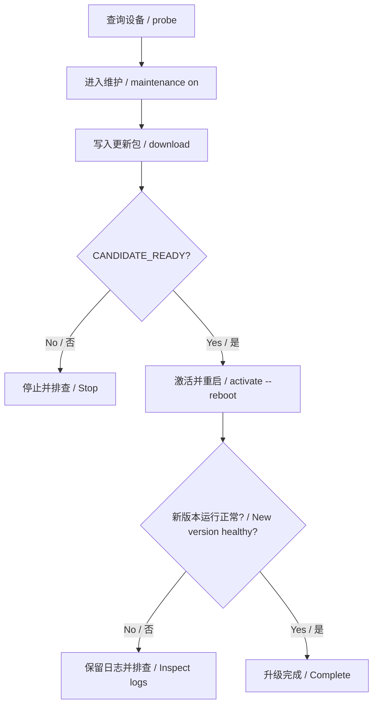

# CAN OTA operator guide

> [中文版](can-update.zh-CN.md)

**Build a package, write it over CAN, activate it, then verify the new firmware.** This guide follows that order. SDK investigation and protocol details are in the [technical reference](can-update-internals.md).

Already have a candidate OS? Start at [packaging](#package). Already have a package and manifest? Start at [installation](#install). A board without working OTA firmware needs [initial USB installation](#bootstrap).

Computer examples use **Windows CMD**. `set`, `%NAME%` and the continuation character `^` are CMD syntax, not PowerShell or board-console commands.

## 1. Build the update package

| File | Purpose | Used by |
|---|---|---|
| `*.img` | Full board image for initial installation | Board USB flashing tool |
| `d13x_os.itb` | Candidate OS from the firmware build | `pack` |
| `ota.cpio` | Packaged OS update | CAN `download` |
| `ota.manifest.json` | Product, hardware, version, length and hash for that package | Used alongside `ota.cpio` |

Keep the package and its manifest together. Do not send a board `.img` or raw `.itb` to `download`.


### 1.1 Build the candidate firmware

**Run in: the SDK CMD window opened by `win_cmd.bat`, at the SDK root.**

Initialize application dependencies using the [build guide](../build/build.md). Run `list` to confirm the Framework configuration number. The example uses `12`; use the number displayed by your SDK.

For a public Demo candidate:

```bat
set "METER_PRODUCT_ROOT=%CD%/application/rt-thread/forklift-meter-platform/products/demo"
set "METER_CAN_UPDATE=1"
set "METER_UPDATE_VERSION=ota-demo-b"
set "METER_BOARD_ID=reference-board"
lunch 12
m
```

**Pass:** the SDK reports a successful build and the selected target's `output/.../images/` contains `d13x_os.itb` and the board `.img`. Preserve the candidate OS in a separate directory before another build overwrites that output.

Keep OTA enabled in the candidate for future CAN updates. Its embedded `METER_UPDATE_VERSION` must equal the packaging version: changing a manifest does not change firmware identity. Use 1–31 characters from letters, digits, `_`, `.`, `+`, `-`.

For another Product, use its Product directory and hardware alias. The build guide also documents `tools.ota.build_board` for automatic source/hash archiving and link-map checks.

<a id="package"></a>

### 1.2 Prepare computer-side tools

**Run in: a host CMD window with Python 3, CMake, Ninja and a C/C++ compiler.** Keep the SDK toolchain unchanged. Windows CAN access also needs the PCAN driver and PCAN-Basic runtime.

Replace the two example paths below. `SDK_ROOT` is the SDK checkout; `CANDIDATE_OS` is the OS file saved in step 1.1. Use this same window for subsequent computer commands.

```bat
set "SDK_ROOT=C:\sdk\luban-lite"
set "CANDIDATE_OS=C:\firmware\ota-demo-b\d13x_os.itb"
cd /d "%SDK_ROOT%\application\rt-thread\forklift-meter-platform"
python --version
python -m pip install -r tools/ota/requirements.txt
cmake -S . -B build-package -G Ninja -DMETER_BUILD_UI=OFF
cmake --build build-package --target meter-ota-inspect
set "METER_OTA_INSPECTOR=%CD%\build-package\meter-ota-inspect.exe"
```

**Pass:** `python --version` reports Python 3 and `build-package/meter-ota-inspect.exe` exists. If either check fails, fix the host environment first. The inspector checks packages; it is not board firmware.

This SDK supplies `tools/scripts/cpio.exe` and `tools/scripts/mkenvimage.exe`. The next command selects them explicitly.

### 1.3 Set parameters and create the package

**Run in: the host CMD window.** Confirm values against UART `meter_update info` or the [device probe](#read-device). The following values are a Demo example; do not guess them for another board.

| Variable | Meaning | Source / check |
|---|---|---|
| `PRODUCT_ID` | Product identity | Device `product` |
| `HARDWARE_ID` | Hardware alias | Device `hardware` |
| `OTA_VERSION` | New firmware version | Candidate's `METER_UPDATE_VERSION` |
| `OS_FILE` | OS member name inside the package | Device `os_file` |
| `CAPACITY_BYTES` | Inactive OS capacity, in bytes | Device `candidate_capacity` |

If the board has no OTA endpoint, install the baseline first and read these values. Do not increase capacity or change identity to bypass a rejection.

```bat
set "PRODUCT_ID=reference-demo"
set "HARDWARE_ID=reference-board"
set "OTA_VERSION=ota-demo-b"
set "OS_FILE=d13x_os.itb"
set "CAPACITY_BYTES=4194304"

python -m tools.ota pack "%CANDIDATE_OS%" "ota-output\%OTA_VERSION%" ^
  --product "%PRODUCT_ID%" --hardware "%HARDWARE_ID%" ^
  --version "%OTA_VERSION%" --os-file "%OS_FILE%" ^
  --candidate-capacity %CAPACITY_BYTES% --pad-os-to 4096 ^
  --cpio "%SDK_ROOT%\tools\scripts\cpio.exe" ^
  --mkenvimage "%SDK_ROOT%\tools\scripts\mkenvimage.exe"
```

**Pass:** exit code `0`, `event=package`, `integrity=PASS`, and all three files under `ota-output/%OTA_VERSION%/`:

- `ota.cpio` — the update bytes.
- `ota.manifest.json` — the matching package description.
- `package-report.json` — the packaging/check record.

The output directory must be new. For a retry, choose a new destination and update subsequent paths. Alignment pads only a temporary OS copy; the original OS file remains unchanged.

### 1.4 Check the package before writing

**Run in: the host CMD window.** This check is offline; it does not connect to CAN or write the board.

```bat
python -m tools.ota preflight "ota-output\%OTA_VERSION%\ota.cpio" ^
  --manifest "ota-output\%OTA_VERSION%\ota.manifest.json" ^
  --os-file "%OS_FILE%" --candidate-capacity %CAPACITY_BYTES%
```

**Pass:** exit code `0`, `integrity=PASS` and `archive_validation=HOST_PASS_DEVICE_REQUIRED`. That last value means the computer check passed but device validation is still required. Stop if preflight fails.

`signature=NOT_PROVIDED` describes the current limit: hash checking detects changed bytes but does not authenticate a firmware publisher.

<a id="install"></a>

## 2. Write over CAN, activate and verify

If you received a prepared package, still complete tool setup in step 1.2 and set the variables in step 1.3 from its manifest and the target device. Place the supplied pair under `ota-output/%OTA_VERSION%/` to use the commands below; skip firmware build and `pack`, but run `preflight`.

Keep power stable throughout. The current firmware endpoint is **CAN0**, with standard request/response IDs **0x7E0 / 0x7E8**. There is no CLI CAN1 or ID override.

Writing and activating are separate operations. A progress value of 100% only means the bytes were transferred.



### 2.1 Check the board over UART

**Run in: the board UART console, 115200 baud, 8N1.** Connect PCAN to CAN0 H/L and reference ground; check termination. The board must be running its application, not waiting in USB download mode.

```text
meter info
meter can 0
meter storage
meter_update info
```

**Pass:** the application responds; record its version and CAN0 bitrate; update diagnostics report `backend_supported=true`. The Demo also needs ready settings storage. Other Products follow their own storage/admission policy.

If `meter_update` is missing, perform initial USB installation. If the backend is unsupported, resolve `backend_reason` before writing. Detecting a PCAN adapter alone does not establish a working board connection.

<a id="read-device"></a>

### 2.2 Read device information through CAN

**Run in: the same host CMD window as section 1.** Set the actual board bitrate. `125000` below applies only when UART reports 125 kbit/s.

Use a new `RUN_ID` for every attempt. Each network command requires a separate, previously unused evidence directory.

```bat
set "CAN_CHANNEL=PCAN_USBBUS1"
set "BITRATE=125000"
set "RUN_ID=ota-demo-b-run01"

python -m tools.ota --channel %CAN_CHANNEL% --bitrate %BITRATE% ^
  --evidence "evidence\%RUN_ID%-probe-before" probe
```

**Pass:** exit code `0` and `event=info`. Compare `device.product`, `hardware`, `os_file` and `candidate_capacity` with packaging parameters. Save `device.version` as the **currently running version**. Probe is read-only and does not require maintenance.

On timeout, stop and check wiring, power and bitrate. Global options such as `--bitrate` and `--evidence` belong before the subcommand.

### 2.3 Enter maintenance and write the package

**First run on the board UART console:**

```text
meter_update maintenance on
meter_update info
```

**Pass:** `maintenance=1`, `backend_supported=true` and Product admission/storage conditions are met. `maintenance requested` alone acknowledges only the request.

**Then run on the host CMD window.** A new download requires `IDLE`, `FAILED` or `ABORTED`. If a validated candidate already exists, activate it or deliberately abort it before another download.

```bat
python -m tools.ota --channel %CAN_CHANNEL% --bitrate %BITRATE% ^
  --evidence "evidence\%RUN_ID%-download" download ^
  "ota-output\%OTA_VERSION%\ota.cpio" ^
  --manifest "ota-output\%OTA_VERSION%\ota.manifest.json" ^
  --os-file "%OS_FILE%" --candidate-capacity %CAPACITY_BYTES%
```

**Pass: all four conditions are required.**

- Exit code `0` and an `event=candidate` result.
- `device.state=CANDIDATE_READY` and `device.error=0`.
- `device.target` equals `OTA_VERSION`.
- `device.received` equals the manifest's `size`.

The device has validated the candidate but is still running the old firmware. Do not activate based only on progress output.

### 2.4 Activate and request reboot

**Run in: the host CMD window after step 2.3 passes.** Keep maintenance enabled through activation.

```bat
python -m tools.ota --channel %CAN_CHANNEL% --bitrate %BITRATE% ^
  --evidence "evidence\%RUN_ID%-activate" activate ^
  --version "%OTA_VERSION%" --reboot
```

**Pass for this step:** exit code `0`, `event=activated`, `device.state=ACTIVATED`, matching `device.target`, `error=0` and `reboot_requested=true`.

`new_firmware_confirmation=NOT_VERIFIED` is expected: this command requests reboot but does not observe the next boot. Continue to step 2.5.

Without `--reboot`, activation does not request an immediate restart. Abort cannot undo an activated update.

### 2.5 Verify the new firmware

**Run in: the board UART console after startup.** Preserve the boot log, including the native slot selection.

```text
meter info
meter can 0
meter storage
meter_update info
meter_update maintenance off
meter_update info
```

Update the host `BITRATE` if the new `meter can 0` result differs. Then query again from the host CMD window:

```bat
python -m tools.ota --channel %CAN_CHANNEL% --bitrate %BITRATE% ^
  --evidence "evidence\%RUN_ID%-probe-after" probe
```

**Only mark the update complete after these checks pass:**

| Check | Required result |
|---|---|
| Running version | `device.version` equals `OTA_VERSION`; a matching `target` alone is insufficient |
| Identity/backend | Product/hardware match, `backend_supported=true` and `error=0` |
| Storage | Ready and retained settings correct when enabled by Product |
| Maintenance | `maintenance=0` after leaving maintenance |
| Application | UI, touch and normal CAN traffic recover as required by Product |

Keep the package, manifest, package report, build identity, before/after probes and UART log. Each network command saves `events.jsonl` and `can.asc` in its evidence directory. A reset request or bootloader auto-confirmation is not runtime acceptance.

<a id="bootstrap"></a>

## 3. First installation through USB

A board without an OTA-enabled running application needs a baseline installed once:

1. Follow step 1.1 with `METER_CAN_UPDATE=1` and baseline version `ota-demo-a`.
2. Preserve the board `.img` and build identity.
3. Enter the board's USB download mode. Use its supported USB tool to write the `.img`, following the board image/partition procedure.
4. Exit download mode, boot normally and pass the UART/backend checks in step 2.1.
5. Build a different candidate such as `ota-demo-b`, then follow sections 1 and 2.

USB installs the board image; CAN OTA updates only the inactive OS partition. A board waiting in USB download mode is not a running CAN OTA endpoint.

## 4. Troubleshooting and abort

Stop at the failed step and preserve its logs. Do not infer success from progress or repeatedly request activation.

| Symptom | Check / next action |
|---|---|
| Packaging tool not found | Check the two executable paths passed to `pack` |
| Inspector missing or cannot start | Build it; check `METER_OTA_INSPECTOR` and compiler runtime availability |
| Output/evidence directory exists | Use a new destination or `RUN_ID`; preserve previous evidence |
| Probe timeout / bus-off | Check application state, CAN0 wiring, termination and exact bitrate |
| Backend unsupported | Read `backend_reason` and resolve backend readiness |
| Identity/partition mismatch | Recheck candidate selection and package parameters against the device |
| Maintenance required / admission rejected | Check `meter_update info`, Product conditions and storage readiness |
| Transfer interrupted / only progress emitted | Inspect device state; candidate validation is not proven |
| Activation fails / `WAIT_DURABLE` | Check storage and durable revision; do not bypass the persistence barrier |
| Old version after reboot | Inspect UART slot selection and `version`; update acceptance has failed |

To discard an unactivated transfer/candidate, use a fresh evidence directory in the host CMD window:

```bat
python -m tools.ota --channel %CAN_CHANNEL% --bitrate %BITRATE% ^
  --evidence "evidence\%RUN_ID%-abort" abort
```

Check returned state/error; query again if cancellation is still in progress. Before another download, the device must return to an allowed starting state. A disconnected device may not receive abort: reconnect and inspect before retrying. Abort is not rollback.

Download-time power loss and automatic rollback are not covered by this procedure. Their current limits remain in the technical reference.

## 5. Terms at a glance

| Term | Plain meaning | Operator implication |
|---|---|---|
| Baseline | Installed firmware able to accept OTA | First installation uses the board image |
| Candidate | New OS waiting to be used | Download success does not mean it is running |
| A/B / inactive slot | One OS runs while the other receives the update | No manual Flash address selection in this CLI |
| Manifest | JSON describing one exact package | Keep it paired with `ota.cpio` |
| Preflight | Offline package checks | Device checks are still required |
| Maintenance | Product-controlled update mode | Enter before writing; exit after verification |
| Activation | Choose a validated candidate for the next boot | Separate from transfer and acceptance |
| NVM / durable | Settings storage / settings actually saved | Enabled storage must finish saving before activation |
| UDS / ISO-TP | Update commands / their CAN transport | Tools handle framing automatically |
| SHA256 | Content fingerprint | Checks changed bytes; not a signature |

## 6. Further reading

- [Build and Product configuration](../build/build.md): source selection and archived builds.
- [Technical reference](can-update-internals.md): SDK review, archive/protocol details and recovery limits.
- [Validation records](../testing/validation.md): results tied to tested source and images.

This documentation change does not establish a new board-validation result.
