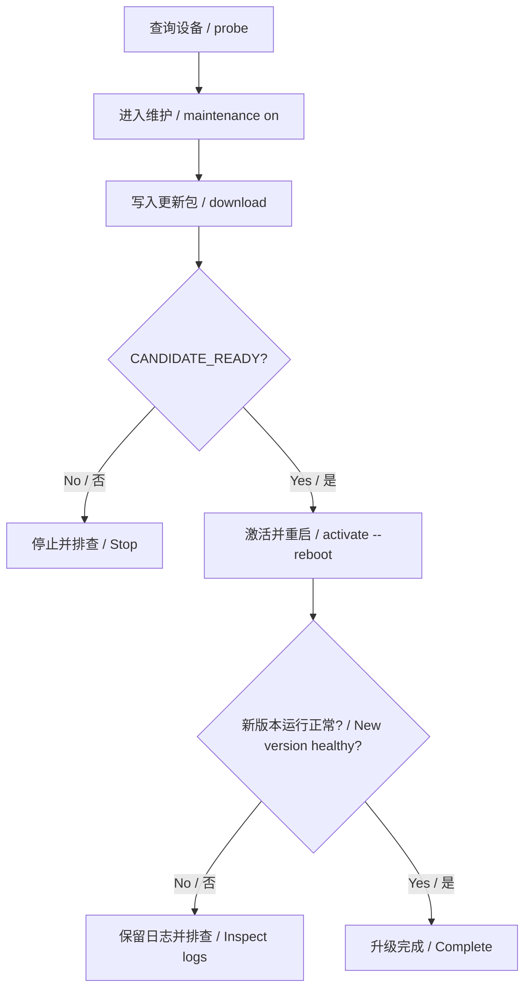

# CAN OTA 操作指南

> [English](can-update.md)

**先构建更新包，再通过 CAN 写入，最后激活并确认新固件正常运行。** 本文按这个顺序操作。SDK 探索与协议细节移到[技术说明](can-update-internals.zh-CN.md)。

已有候选 OS？从[打包](#package)开始。已有更新包和配套清单？从[刷入](#install)开始。板上还没有可用的 OTA 固件？先完成[首次 USB 安装](#bootstrap)。

电脑端示例采用 **Windows CMD**。`set`、`%NAME%`、续行符 `^` 属于 CMD 语法，不要直接粘贴到 PowerShell 或板端串口。

## 1. 构建 OTA 更新包

| 文件 | 用途 | 交给谁 |
|---|---|---|
| `*.img` | 用于首次安装的整板镜像 | 板卡 USB 烧录工具 |
| `d13x_os.itb` | 固件构建生成的候选 OS | `pack` 打包命令 |
| `ota.cpio` | 封装好的 OS 更新包 | CAN `download` 命令 |
| `ota.manifest.json` | 该包的产品、硬件、版本、长度和摘要清单 | 与 `ota.cpio` 配套使用 |

更新包和清单必须成对保存。不要把整板 `.img` 或未经打包的 `.itb` 交给 `download`。


### 1.1 构建候选固件

**执行位置：通过 `win_cmd.bat` 打开的 SDK CMD 窗口，当前目录为 SDK 根目录。**

应用依赖初始化见[构建指南](../build/build.zh-CN.md)。先用 `list` 确认 Framework 配置编号。示例为 `12`，以你的 SDK 实际列表为准。

以公开 Demo 的候选版本为例：

```bat
set "METER_PRODUCT_ROOT=%CD%/application/rt-thread/forklift-meter-platform/products/demo"
set "METER_CAN_UPDATE=1"
set "METER_UPDATE_VERSION=ota-demo-b"
set "METER_BOARD_ID=reference-board"
lunch 12
m
```

**通过判据：** SDK 报告构建成功，所选目标的 `output/.../images/` 包含 `d13x_os.itb` 和整板 `.img`。编译开始前，SCons 会打印解析后的 Product 根目录、Product 身份和板卡别名，请确认这三项就是受测 Product；复用的 CMD 窗口往往还带着上一次的 `METER_PRODUCT_ROOT`。先把候选 OS 另存到独立目录，避免被下一次构建覆盖。

候选固件也应启用 OTA，才能继续通过 CAN 升级。内嵌的 `METER_UPDATE_VERSION` 必须与打包版本相同：修改清单不会改变固件身份。版本可用字母、数字、`_`、`.`、`+`、`-`，长度为 1–31 个字符。

其他 Product 应使用各自的 Product 目录和硬件别名。需要自动归档源码身份、摘要、Product 身份与链接映射检查时，可用构建指南中的 `tools.ota.build_board`。

<a id="package"></a>

### 1.2 准备电脑端工具

**执行位置：能够使用 Python 3、CMake、Ninja 和 C/C++ 编译器的 Host CMD 窗口。** 保持 SDK 工具链不变。Windows 连接 CAN 还需要 PCAN 驱动和 PCAN-Basic 运行库。

替换下面两个示例路径：`SDK_ROOT` 指向 SDK 仓库，`CANDIDATE_OS` 指向步骤 1.1 另存的 OS 文件。后续电脑端命令都在这个窗口执行。

```bat
set "SDK_ROOT=C:\sdk\luban-lite"
set "CANDIDATE_OS=C:\firmware\ota-demo-b\d13x_os.itb"
cd /d "%SDK_ROOT%\application\rt-thread\forklift-meter-platform"
python --version
python -m pip install -r tools/ota/requirements.txt
cmake -S . -B build-package -G Ninja -DMETER_BUILD_UI=OFF
cmake --build build-package --target meter-ota-inspect
set "METER_OTA_INSPECTOR=%CD%\build-package\meter-ota-inspect.exe"
```

**通过判据：** `python --version` 显示 Python 3，且 `build-package/meter-ota-inspect.exe` 已生成。任一条件不满足，先修复 Host 环境。检查器用于检查更新包，不是要刷入板端的固件。

本 SDK 提供 `tools/scripts/cpio.exe` 和 `tools/scripts/mkenvimage.exe`，下一步会显式指定它们。

### 1.3 设置参数并生成更新包

**执行位置：Host CMD 窗口。** 参数应与串口 `meter_update info` 或[设备查询](#read-device)的返回值核对。下面是 Demo 示例，不是其他板卡可直接套用的默认值。

| 变量 | 含义 | 来源或核对方法 |
|---|---|---|
| `PRODUCT_ID` | 产品身份 | 设备返回的 `product` |
| `HARDWARE_ID` | 硬件别名 | 设备返回的 `hardware` |
| `OTA_VERSION` | 新固件版本 | 候选构建时的 `METER_UPDATE_VERSION` |
| `OS_FILE` | 包内 OS 文件名 | 设备返回的 `os_file` |
| `CAPACITY_BYTES` | 非活动 OS 分区容量，单位为字节 | 设备返回的 `candidate_capacity` |

板上还没有 OTA 端点时，先安装基线再读取这些值。不要为绕过拒绝而增加容量或修改身份。

```bat
set "PRODUCT_ID=reference-demo"
set "HARDWARE_ID=reference-board"
set "OTA_VERSION=ota-demo-b"
set "OS_FILE=d13x_os.itb"
set "CAPACITY_BYTES=4194304"

python -m tools.ota pack "%CANDIDATE_OS%" "ota-output\%OTA_VERSION%" ^
  --product "%PRODUCT_ID%" --hardware "%HARDWARE_ID%" ^
  --version "%OTA_VERSION%" --os-file "%OS_FILE%" ^
  --candidate-capacity %CAPACITY_BYTES% --pad-os-to 4096 ^
  --cpio "%SDK_ROOT%\tools\scripts\cpio.exe" ^
  --mkenvimage "%SDK_ROOT%\tools\scripts\mkenvimage.exe"
```

**通过判据：** 退出码为 `0`，输出含 `event=package`、`integrity=PASS`，且 `ota-output/%OTA_VERSION%/` 中三个文件齐全：

- `ota.cpio`：实际传输的更新包。
- `ota.manifest.json`：配套更新包清单。
- `package-report.json`：打包和检查记录。

输出目录必须事先不存在。重试时换一个新目录，并同步调整后续路径。对齐只修改临时 OS 副本，不修改原始 OS 文件。

### 1.4 刷入前检查更新包

**执行位置：Host CMD 窗口。** 这一步离线运行，不连接 CAN，也不写入设备。

```bat
python -m tools.ota preflight "ota-output\%OTA_VERSION%\ota.cpio" ^
  --manifest "ota-output\%OTA_VERSION%\ota.manifest.json" ^
  --os-file "%OS_FILE%" --candidate-capacity %CAPACITY_BYTES%
```

**通过判据：** 退出码为 `0`，`integrity=PASS`，`archive_validation=HOST_PASS_DEVICE_REQUIRED`。最后一个值表示“电脑检查通过，仍需板端验证”。预检失败就停止。

`signature=NOT_PROVIDED` 表示当前未提供签名认证：摘要能检查字节变化，不能认证固件发布者。

<a id="install"></a>

## 2. 通过 CAN 刷入、激活并确认

如果拿到的是现成更新包，仍需按步骤 1.2 准备工具，并按清单和目标设备填写步骤 1.3 的变量。将配套文件放入 `ota-output/%OTA_VERSION%/` 后可使用下面的命令；跳过固件构建和 `pack`，但仍执行 `preflight`。

全程保持稳定供电。当前固件端点在 **CAN0**，标准帧请求/响应 ID 为 **0x7E0 / 0x7E8**。CLI 暂无 CAN1 或 ID 覆盖参数。

写入和激活是独立操作。进度达到 100% 只说明字节传输完成。



### 2.1 通过串口检查板端

**执行位置：板端 UART 串口，115200 波特率、8N1。** 将 PCAN 接到 CAN0 H/L 和参考地，检查终端电阻。板端应运行应用，而不是停留在 USB 下载模式。

```text
meter info
meter can 0
meter storage
meter_update info
```

**通过判据：** 应用可响应，记下当前版本和 CAN0 实际速率；升级诊断返回 `backend_supported=true`。Demo 还要求设置存储就绪，其他 Product 按自身存储和准入策略核对。

没有 `meter_update` 命令时，先做首次 USB 安装。后端不支持时，先根据 `backend_reason` 排查。电脑能发现 PCAN 适配器，不代表已与板端正常通信。

<a id="read-device"></a>

### 2.2 通过 CAN 查询设备

**执行位置：第 1 节的同一个 Host CMD 窗口。** 填入板端实际速率。下面的 `125000` 只适用于 UART 报告 125 kbit/s 的情况。

每轮操作换一个新的 `RUN_ID`。每条联网命令都需要独立且尚不存在的证据目录。

```bat
set "CAN_CHANNEL=PCAN_USBBUS1"
set "BITRATE=125000"
set "RUN_ID=ota-demo-b-run01"

python -m tools.ota --channel %CAN_CHANNEL% --bitrate %BITRATE% ^
  --evidence "evidence\%RUN_ID%-probe-before" probe
```

**通过判据：** 退出码为 `0`，收到 `event=info`。把 `device.product`、`hardware`、`os_file`、`candidate_capacity` 与打包参数逐项核对。保存 `device.version`，它是**当前运行版本**。Probe 只读，不要求已进入维护模式。

查询超时就停止，先检查接线、供电和速率。`--bitrate`、`--evidence` 等全局参数必须位于子命令前。

### 2.3 进入维护模式并写入更新包

**先在板端 UART 串口执行：**

```text
meter_update maintenance on
meter_update info
```

**通过判据：** `maintenance=1`、`backend_supported=true`，并满足 Product 准入和存储条件。仅打印 `maintenance requested` 只代表请求已提交。

**随后在 Host CMD 执行。** 新下载要求状态为 `IDLE`、`FAILED` 或 `ABORTED`。若已有验证通过的候选，应激活该候选，或明确中止后再下载。

```bat
python -m tools.ota --channel %CAN_CHANNEL% --bitrate %BITRATE% ^
  --evidence "evidence\%RUN_ID%-download" download ^
  "ota-output\%OTA_VERSION%\ota.cpio" ^
  --manifest "ota-output\%OTA_VERSION%\ota.manifest.json" ^
  --os-file "%OS_FILE%" --candidate-capacity %CAPACITY_BYTES%
```

**通过判据：以下四项必须同时满足。**

- 退出码为 `0`，输出包含 `event=candidate`。
- `device.state=CANDIDATE_READY`，且 `device.error=0`。
- `device.target` 等于 `OTA_VERSION`。
- `device.received` 等于清单中的 `size`。

这时板端已验证候选，但仍在运行旧固件。不能只根据进度输出执行激活。

### 2.4 激活并请求重启

**执行位置：Host CMD，必须先通过步骤 2.3。** 激活完成前保持维护模式。

```bat
python -m tools.ota --channel %CAN_CHANNEL% --bitrate %BITRATE% ^
  --evidence "evidence\%RUN_ID%-activate" activate ^
  --version "%OTA_VERSION%" --reboot
```

**本步骤通过判据：** 退出码为 `0`，`event=activated`，`device.state=ACTIVATED`，`device.target` 匹配，`error=0`，且 `reboot_requested=true`。

`new_firmware_confirmation=NOT_VERIFIED` 是预期行为：命令请求重启，但没有观测下一次启动。必须继续步骤 2.5。

不加 `--reboot` 时，激活不会请求立即重启。已经激活的更新不能通过中止命令撤销。

### 2.5 确认新固件运行

**执行位置：重启后的板端 UART 串口。** 保存启动日志，包含原生启动槽位选择信息。

```text
meter info
meter can 0
meter storage
meter_update info
meter_update maintenance off
meter_update info
```

如果新的 `meter can 0` 返回值不同，先更新 Host 中的 `BITRATE`，再从 Host CMD 查询：

```bat
python -m tools.ota --channel %CAN_CHANNEL% --bitrate %BITRATE% ^
  --evidence "evidence\%RUN_ID%-probe-after" probe
```

**以下检查通过，才能判定升级完成：**

| 检查项 | 要求 |
|---|---|
| 运行版本 | `device.version` 等于 `OTA_VERSION`，仅有 `target` 匹配不够 |
| 身份与后端 | Product/Hardware 匹配，`backend_supported=true`、`error=0` |
| 存储 | Product 启用存储时，存储就绪且保留值正确 |
| 维护状态 | 退出维护后 `maintenance=0` |
| 正常应用 | UI、触摸及普通 CAN 按 Product 要求恢复 |

保存更新包、清单、打包报告、构建身份、升级前后查询和 UART 日志。每条联网命令在各自证据目录保存 `events.jsonl`、`can.asc`。重启请求或 Bootloader 自动确认，不等于运行验收。

<a id="bootstrap"></a>

## 3. 首次通过 USB 安装

板上还没有启用 OTA 的正常运行应用时，需要先安装一次基线：

1. 按步骤 1.1 设置 `METER_CAN_UPDATE=1`，构建基线版本 `ota-demo-a`。
2. 保存整板 `.img` 和构建身份。
3. 进入板卡 USB 下载模式，按板卡镜像和分区规范，用配套 USB 工具写入 `.img`。
4. 退出下载模式并正常启动，通过步骤 2.1 的串口和后端检查。
5. 再构建不同的候选，例如 `ota-demo-b`，按第 1、2 节完成 CAN 升级。

USB 安装整板镜像，CAN OTA 只更新非活动 OS 分区。停留在 USB 下载模式的板卡，不是正在运行的 CAN OTA 端点。

## 4. 排错与中止

停在失败步骤并保留日志。不要凭进度推断成功，也不要反复请求激活。

| 现象 | 检查与下一步 |
|---|---|
| 找不到打包工具 | 核对 `pack` 指定的两个可执行文件路径 |
| 找不到或无法启动检查器 | 构建检查器，检查 `METER_OTA_INSPECTOR` 和编译器运行库 |
| 输出或证据目录已存在 | 换新目录或 `RUN_ID`，保留旧证据 |
| Probe 超时或 bus-off | 检查应用状态、CAN0 接线、终端电阻和实际速率 |
| 后端不支持 | 根据 `backend_reason` 解决后端就绪问题 |
| 身份或分区不匹配 | 对照设备核对候选选择和打包参数 |
| 要求维护模式或拒绝准入 | 检查 `meter_update info`、Product 条件和存储就绪状态 |
| 传输中断或只有进度 | 检查设备状态，此时尚未证明候选验证通过 |
| 激活失败或 `WAIT_DURABLE` | 检查存储和落盘版本，不绕过持久化条件 |
| 重启后仍是旧版本 | 检查 UART 槽位选择和 `version`，不能判为验收通过 |

丢弃尚未激活的传输或候选时，在 Host CMD 使用新的证据目录执行：

```bat
python -m tools.ota --channel %CAN_CHANNEL% --bitrate %BITRATE% ^
  --evidence "evidence\%RUN_ID%-abort" abort
```

检查返回状态和错误；若取消仍在处理中，再次查询。重新下载前，设备必须回到允许开始的状态。断线设备可能未收到中止请求，应重连后先查状态。中止不等于回滚。

本流程不包含下载中断电和自动回滚测试。当前限制保留在技术说明中。

## 5. 术语速查

| 术语 | 通俗解释 | 操作者需要知道的事 |
|---|---|---|
| 基线 Baseline | 已安装、能够接收 OTA 的固件 | 首次安装使用整板镜像 |
| 候选 Candidate | 等待投入使用的新 OS | 下载成功不代表它已运行 |
| A/B、非活动槽位 | 一份 OS 运行，另一份接收更新 | CLI 不需要手选 Flash 地址 |
| Manifest 清单 | 描述某一个更新包的 JSON | 与对应 `ota.cpio` 配套保存 |
| Preflight 预检 | 电脑端离线检查更新包 | 之后仍需板端检查 |
| Maintenance 维护模式 | Product 控制的允许升级状态 | 写入前进入，验证后退出 |
| Activation 激活 | 选择验证后的候选供下次启动 | 与传输、验收分别判定 |
| NVM、durable | 设置存储、设置已实际保存 | 启用存储时，激活前须落盘 |
| UDS、ISO-TP | 升级命令及其 CAN 传输机制 | 工具自动处理分帧 |
| SHA256 | 文件内容摘要 | 检查字节变化，不是签名 |

## 6. 进一步阅读

- [构建与 Product 配置](../build/build.zh-CN.md)：源码选择及归档构建。
- [技术说明](can-update-internals.zh-CN.md)：SDK 审查、包和协议细节、恢复限制。
- [验证记录](../testing/validation.zh-CN.md)：与测试源码和镜像对应的结果。

本次文档调整不构成新的实板验证结果。
